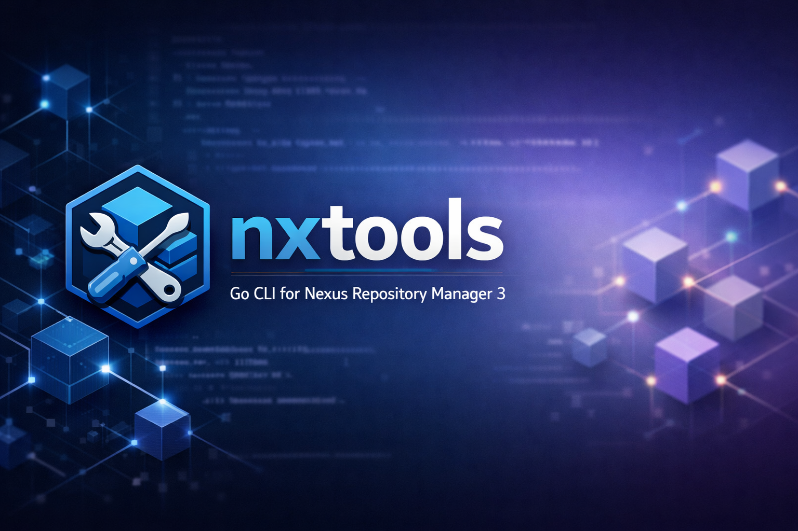
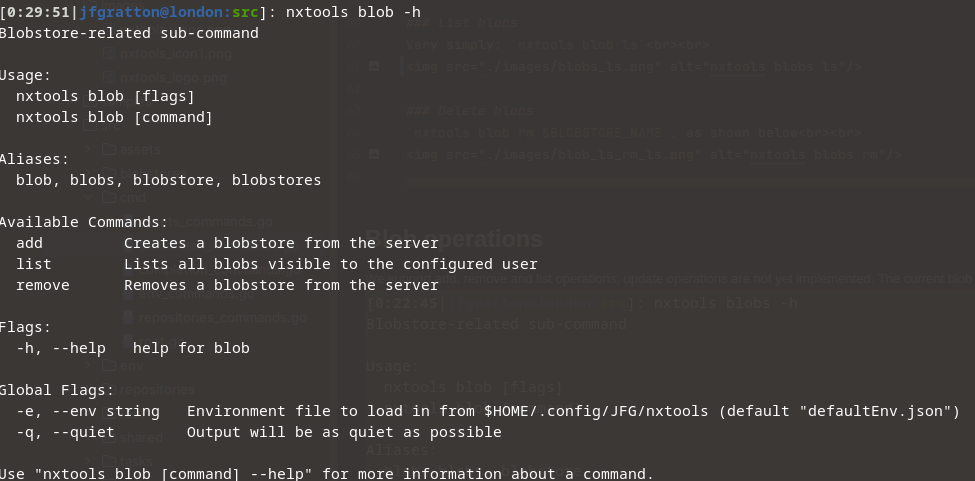
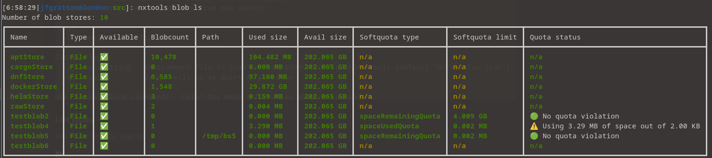
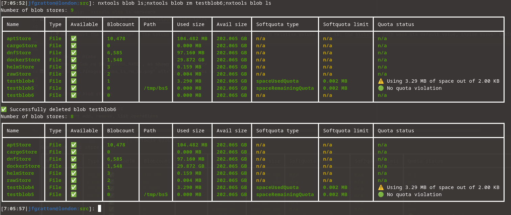
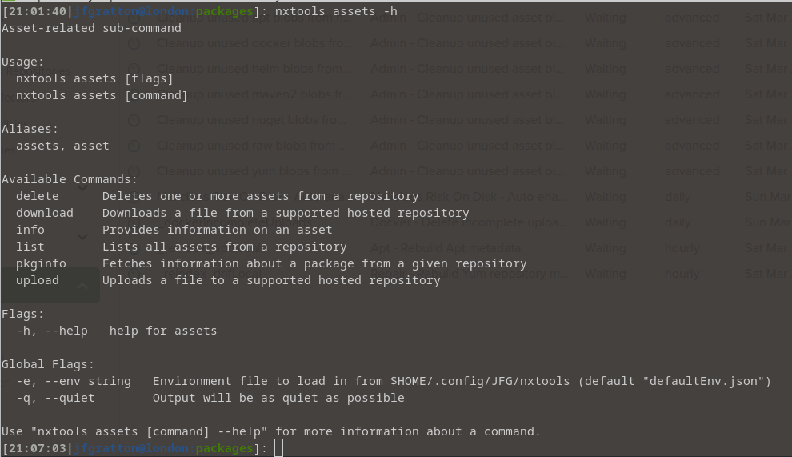
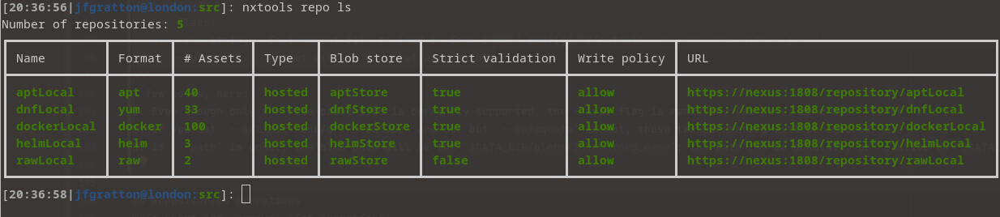

# 
___

This tool is a CLI-driven client to Nexus Repository Manager 3 servers.<br>It will allow:
- authentication
- blob store ops (list, delete, create)
- user + role ops (list, delete, create, edit)
- repo ops (list, delete, create, edit, upload+download package)
- more to come

## Build/install requirements

You have three alternatives:
- [Install from source](#Install from source)
- [Install from a binary package](#Install from a binary package)
- [Build your own APK, DEB, RPM packages, then manually install those packages](#Build your own package)

Installing from source requires a bit more work in the sense that GO has to be installed on your system

### Install from source
1. Clone/fork the repo : either `git clone https://github.com/jeanfrancoisgratton/nxtools` or `git clone https://git.famillegratton.net:3000/devops/nxtools`
2. Ensure that you have the proper GO version, as stated in the `go.version` file in the root of the repo. Your GO version should be equal or higher than the one in that file. To ensure, run `go version`
3. cd to `src`, and then run: `./updateBuildDeps.sh`, to ensure that all build dependencies are up to date; this might be overkill, but I always run it nonetheless
4. run `./build.sh`. By default the binary will be created in /opt (check the dir's permission ahead of running it). Examine that script, you can taylor the output as you see fit

### Install from a binary package
The simplest way : just go in the RELEASES tab of the repo, select your format, download it, and then install throught you package manager

### Build your own package
The scripts and files (__alpine/, __debian, nxtools.spec) are there for my own ease of work; I usually build my tools using "builder containers" for each format: `apkbuilder`, `debbuilder`, `rpmbuilder`
I'll leave you with homeworks, and will show you how to roughly reproduce my environment

**The three methods below assume that you have forked (not just cloned) the repo somewhere**

#### ALPINE (APKBUILDER)
1. In an Alpine container or VM, you need the following packages: `abuild-doc pax-utils git alpine-sdk`. Some other packages might be needed, depending on the config in __alpine/APKBUILD
2. From the `__alpine`, run: `abuild -r`

This should give you an Alpine package

#### DEBIAN (DEBBUILDER)
1. cd to `__debian`
2. Besides binutils, you do not need any specific package, and of course the required GO version. Have a look at `../go.version`, and `./1.install-build-deps.sh`.
3. Run `./2.build_binary.sh`
4. Copy the .deb file in a safe space, then run `./restore_repo.sh`

#### RPM (RPMBUILDER)
**FORK OR COPY the repo, do not CLONE** it; there's a step there that would fail, otherwise (see step #4)
1. Ensure that tito is installed; the easy way is with pip: `pip install tito`
2. Ensure that all other build deps are installed; from the nxtools root directory, run: `./rpmbuild-deps.sh`
3. Run the following: `tito tag --keep-version`
4. Run the following: `git push --follow-tags origin` --> **This has to be done from a forked repo, otherwise if you point at my own repo, it will likely fail**
5. Run the following: `tito build --rpm` : the result will be in /tmp/tito/ copy the files (SRPM, RPM) in a safe place

## Blob operations
We support add, remove and list operations; update operations are not yet implemented. The current blob subcommands are:


### List blobs
Very simply: `nxtools blob ls`<br><br>


*A note about the Path column* : the column will not show any data for paths with relative values (that is: the blobstore path uses its default value, inside Nexus' $DATA_DIR)


### Delete blobs
`nxtools blob rm $BLOBSTORE_NAME`, as shown below<br><br>


*Note:* You will not be able to delete a blob store if Blobcount > 0 (that is: it is not empty)

### Create blob stores
Currently, only file-based stores are supported

```bash
[20:30:49|jfgratton@london:src]: nxtools-documentation blob add -h
Creates a blobstore from the server

Usage:
  nxtools blob add [flags]

Aliases:
  add, create

Examples:
nxtools blob add FLAGS blobstore

Flags:
  -h, --help            help for add
      --path string     File blob path
  -s, --softquota       Soft quota enabled or not
      --sqlimit int     Soft quota limit
      --sqtype string   Softquota type, 'spaceRemainingQuota' or 'spaceUsedQuota' (default "spaceUsedQuota")
      --type string     Blob type (file, gcp, amazon, azure, group) (default "file")

Global Flags:
  -e, --env string   Environment file to load in from $HOME/.config/JFG/nxtools (default "defaultEnv.json")
  -q, --quiet        Output will be as quiet as possible
```
A few notes, here:
1. Even though only the file-based type is currently supported, the --type flag is mandatory (so here, it'd be: `--type file`)
2. If you set `--sqlimit` and/or `--sqtype` are set but `--softquota` is not, those two parameters will be ignored
3. if `--path` is unset, the blob path will be the `$DATA_DIR/blobs/$blobstore_name`; the path can be absolute, or relative to `$DATA_DIR/blobs`

## Assets operations
Some of the assets operations here work against repositories; both assets and repositories are kind of tightly-coupled. The supported (so far) operations are:


### Assets listing
Lists assets in a given repo
`nxtools assets ls [-a] [-l] REPONAME`

The flags:
- [-a] : lists alternate info than the usual ones
- [-l] : only lists the latest versions of all packages

Also, note that when listing assets in a docker registry, it will only show the manifests, not anything else; the output would be way too noisy otherwise.
If you need to list the actual images and tags, you should use my other tool, [dtools2](https://github.com/jeanfrancoisgratton/dtools2) :

### Upload an asset (package) to a repo
The syntax is: ``

## Repositories operations
We support remove and list operations. Add operations are forthcoming.
```bash
[20:36:58|jfgratton@london:src]: nxtools repo -h
Repository-related sub-command

Usage:
  nxtools repo [flags]
  nxtools repo [command]

Aliases:
  repo, repos, repositories

Available Commands:
  create      Creates a repository (payload is recipe-specific)
  delete      Deletes a repository by name
  list        Lists all repositories visible to the configured user
  reindex     Rebuilds the repository metadata
  type        Returns the type of the repository

Flags:
  -h, --help   help for repo

Global Flags:
  -e, --env string   Environment file to load in from $HOME/.config/JFG/nxtools (default "defaultEnv.json")
  -q, --quiet        Output will be as quiet as possible

Use "nxtools repo [command] --help" for more information about a command.
```


### List repos
Again, very simply: `nxtools repos ls`


### Remove repos
Follows the usual pattern: `nxtools repo rm REPONAME`

**Please be aware that this operation is irreversible, and *will* delete non-empty repos**

### Reindex repos
This goes this way: `nxtools [repos] reindex REPONAME`
```bash
[21:01:34|jfgratton@london:packages]: nxtools reindex aptLocal
✅ Repository aptLocal was successfully reindexed
```

You use this operation after having uploaded a package to the named repository.
#### PRE-REQUISITES
`nxtools` has not yet implemented tasks creation, and might never do so (unsure of that, yet), so it calls upon tasks that **have to already be present through the webUI**
The task names have to follow this naming scheme: `_reindex_$REPONAME`, thus to reindex the repo `dnfLocal`, you would need to have a task named `_reindex_dnfLocal` already present